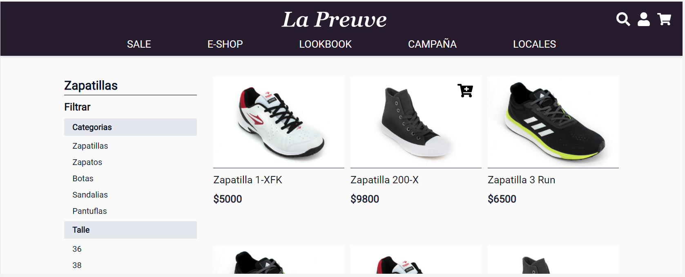
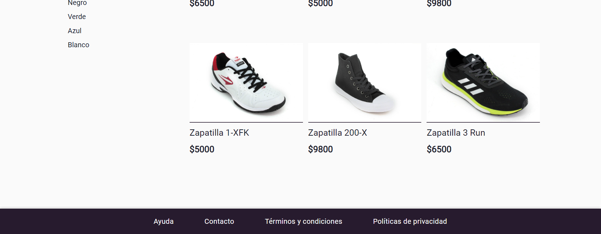
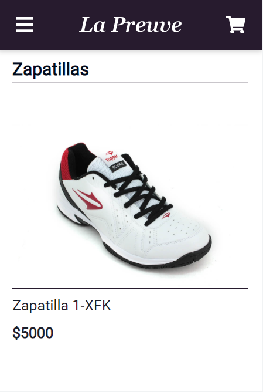
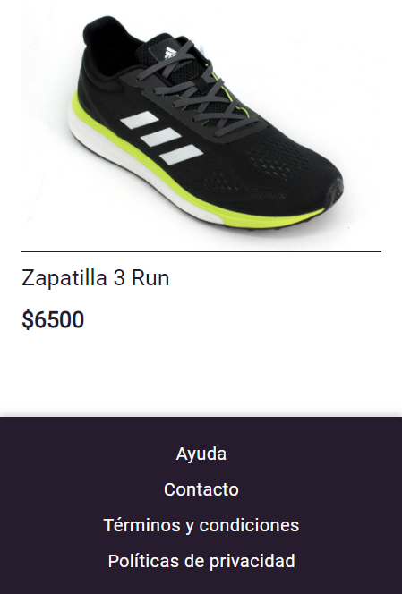
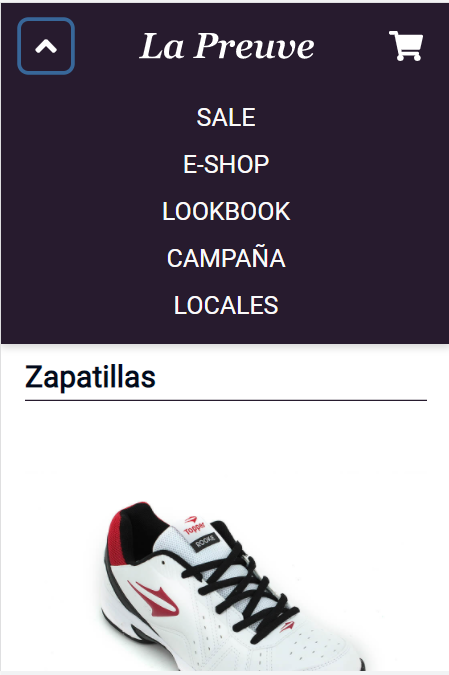
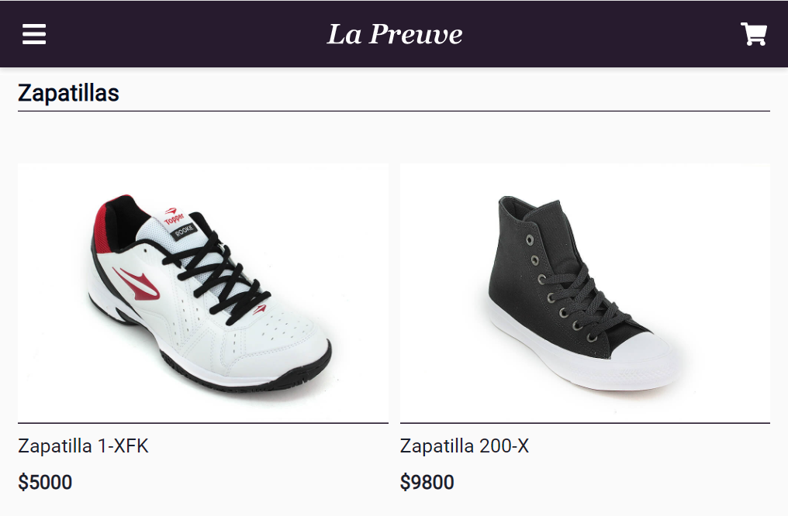

<p align="center">
    
   </p>

# Glamit Challenge

## Ejercicio de maquetado html & css
En el siguiente vínculo vas a encontrar el diseño de una web hecho en Adobe XD, en versión desktop y mobile:
https://xd.adobe.com/view/f3229a4d-559d-4a23-500f-6c99f584ac0e-8513/
Podés alternar entre la vista interactiva o la vista de especificaciones con los botones de la derecha, para poder ver datos de medidas, tipografías, colores, etc.

## Objetivo
El objetivo del ejercicio es maquetar el diseño usando html y css. Cuanto más fiel al diseño sea el resultado mejor.
Podés armarlo como te sea más cómodo, si preferís usar sass, less, o incluso algún framework. Siempre aclarando si hace falta hacer alguna instalación o correr algún comando para poder ver el resultado.

#### Evaluaremos:
* Fidelidad al diseño desktop y mobile
* Que el resultado sea responsive
* Código prolijo y semántico
* Convenciones en nombres de clases (ej BEM)

#### Puntos opcionales:
Cualquier detalle que le quieras agregar es bienvenido, pero opcional, aquí algunas sugerencias:
* Armar un menú desplegable para mobile
* Hacer una funcionalidad de acordeon para los filtros para ocultar/mostrar cada atributo
* Hacer que al seleccionar un atributo de los filtros se muestren solo algunos de los productos
* Agregar un selector o botones arriba a la derecha para cambiar la cantidad de columnas de la grilla de productos entre 2, 3 y 4 en desktop, ó 1 y 2 en mobile.
* Cargar los productos tomando info desde un archivo JSON externo


### Diseño Desktop

<div>
  
</div>


<div>
  
</div>


### Diseño Mobile

<p align="center">
  
</p>

<p align="center">
  
</p>

<p align="center">
  
</p>

### Diseño Tablet
<p align="center">
  
</p>


## Demo

[https://glamit-challenge-lxcts498n-julioale21.vercel.app/](https://glamit-challenge-lxcts498n-julioale21.vercel.app/)


### Estructura del proyecto

### Herramientas
- ViteJS
- React
- Typescript
- Chakra UI
- Axios

The files are structured as follow:

    ├── docs                 # Imagenes para el README
    ├── public               # Archivos estáticos
    ├── src
        ├── assets           # Recursos del proyecto
        ├── components       # Stateless components
        ├── context          # Estado global de la App
        ├── pages            # Páginas que componen la App
        ├── services         # Servicios para conectar la App con el backend
    └── README.md            # The first page that the user will view when will visit the repository.
    
    
## Despliegue Local
```
Clonar el repositorio

Ejecutar el comando npm install

Ejecutar el comando npm run serve
```

